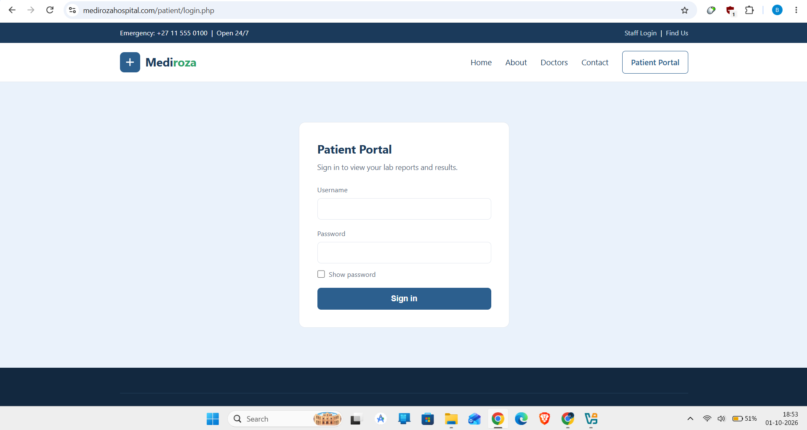
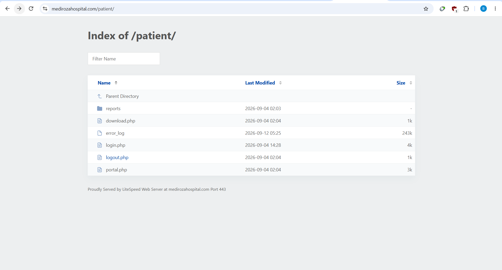
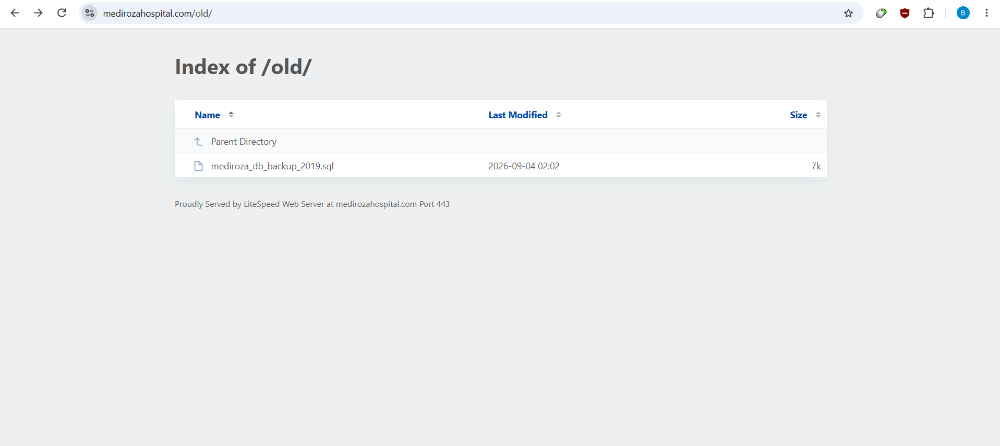
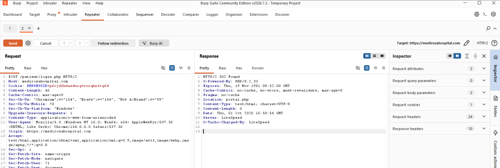
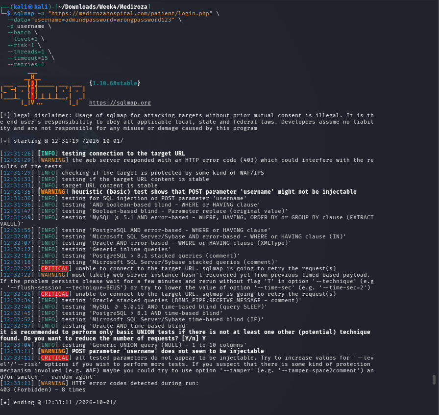
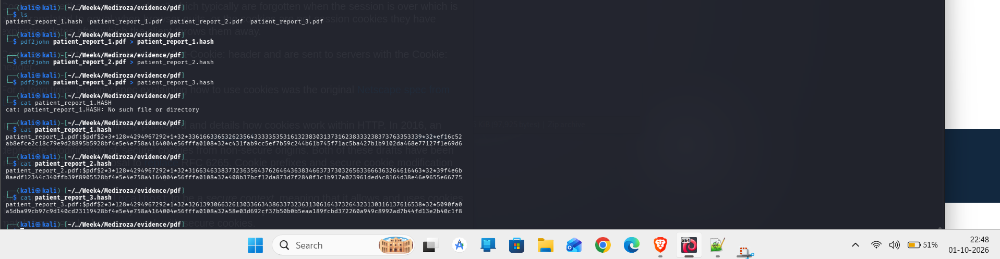

<div align="center">

# Mediroza General Hospital
## Independent Web Application Security Assessment

### Evidence-Driven Black-Box Penetration Test • Exploitation Validation • Cryptographic Analysis • Remediation Engineering

<p>


</p>

**Author:** Chandrashekar Bala  
**Assessment Type:** Authorized external black-box web application security assessment  
**Target:** `https://medirozahospital.com`  
**Observed IP:** `199.188.201.16`  
**Assessment Date:** October 2026  
**Primary Platform:** Kali Linux  
**Repository Purpose:** Professional security portfolio, technical evidence preservation and reproducible assessment documentation

</div>

<div align="center">

### Quick Access

[📄 Full Technical Report](reports/Mediroza_Penetration_Test_Report.pdf) · [📑 Portfolio Case Study](reports/Mediroza_Portfolio_Case_Study.pdf) · [🧪 Raw Nmap](nmap/) · [🧾 Evidence](evidence/) · [📚 Documentation](documentation/) · [🔐 Confidential Command Register](confidential/command-register.md)

</div>

---

# ⚠️ Responsible Use & Authorization

This repository documents work performed against a **specifically authorized security-testing target** in a controlled Networkwalks assessment environment.

The techniques, commands and methodology shown here must only be used against systems for which the tester has explicit authorization.

The assessment rules were limited to the target domain and prohibited social engineering, denial-of-service activity and testing outside the agreed scope. The work was intended to demonstrate real security impact while avoiding destructive actions.

> **Public-release rule:** the public-facing version of this project must not expose patient records, recovered passwords, raw password hashes, employee/shareholder records, session cookies or other sensitive assessment artifacts. The `evidence` tree contains the sensitive assessment artifacts and should be kept private when those artifacts are included.

---

# 📌 What This Project Is

This project is an end-to-end **independent web application security assessment** of a simulated hospital web application. It begins from the same external position available to an unauthenticated internet attacker and progresses through reconnaissance, attack-surface mapping, authentication testing, controlled exploitation, sensitive-data validation, cryptographic analysis and remediation design.

The important part of the project is not simply the number of vulnerabilities discovered. The assessment demonstrates how separate weaknesses can be correlated into a defensible attack narrative:

```text
External target
      │
      ▼
DNS / HTTP / network reconnaissance
      │
      ▼
Application attack-surface mapping
      │
      ├───────────────┐
      ▼               ▼
Directory exposure   Authentication surface
      │               │
      ▼               ▼
Public database       SQL injection
backup                │
      │               ▼
      │        Authentication bypass
      │               │
      └───────┬───────┘
              ▼
       Sensitive data access
              │
        ┌─────┴─────┐
        ▼           ▼
   Patient PDFs   HR/shareholder data
        │
        ▼
Offline PDF cryptographic analysis
        │
        ▼
Password recovery
        │
        ▼
Impact demonstration
        │
        ▼
Risk model + remediation + retest plan
```

The result is a complete security story rather than a collection of disconnected scanner screenshots.

---

# 🎯 Assessment Objectives

The original assessment was structured around four major milestones. This repository preserves those objectives while presenting the work as a standalone security engineering project.

## M1 — Initial Access & Patient Data Retrieval

Objective:

- Perform black-box reconnaissance.
- Identify externally reachable application surfaces.
- Analyze authentication controls.
- Test input handling.
- Demonstrate controlled authentication bypass where evidence supports it.
- Retrieve the three patient pathology-report artifacts referenced by the application.

## M2 — Cryptographic Analysis & Password Recovery

Objective:

- Analyze the protection applied to the retrieved PDF documents.
- Extract the relevant cryptographic metadata.
- Generate crackable representations where appropriate.
- Test password recovery methods.
- Recover the passwords protecting all three assessment PDFs.
- Validate the recovered credentials by decrypting the documents and checking the resulting files.

## M3 — Sensitive Business Data Exposure

Objective:

- Inspect publicly reachable legacy/server content.
- Identify exposed database material.
- Determine what categories of information are contained in the backup.
- Quantify staff and shareholder exposure.
- Analyze the business impact of the exposed data.

## M4 — Professional Security Assessment

Objective:

- Consolidate evidence.
- Assign severity and CVSS/CWE mappings.
- Explain root cause and exploitation path.
- Document limitations and non-findings.
- Provide engineering-grade remediation.
- Define objective retest criteria.

---

# 🧭 Scope

| Scope item | Assessment value |
|---|---|
| Primary target | `https://medirozahospital.com` |
| Observed IPv4 | `199.188.201.16` |
| Assessment model | External black-box |
| Starting privilege | Unauthenticated internet position |
| Application focus | Public web application and exposed supporting surfaces |
| Authorization | Written authorization for the controlled assessment |
| Social engineering | Out of scope |
| Denial of service | Out of scope |
| Unrelated external systems | Out of scope |
| Destructive activity | Not performed |
| Evidence preservation | Raw outputs + screenshots + hashes + reports |

The presence of shared-hosting services was treated carefully. Services such as mail, FTP and cPanel were documented as observed attack surface, but provider/shared-infrastructure observations were not automatically promoted to application vulnerabilities.

---

# 🧰 Tools & Technologies

| Tool / technology | Role in the assessment |
|---|---|
| **Kali Linux** | Primary assessment environment |
| **Nmap** | TCP discovery, service enumeration and service/version validation |
| **cURL** | HTTP request construction, response inspection and artifact retrieval |
| **Burp Suite** | Interception and manual HTTP request/response analysis |
| **sqlmap** | Automated SQL-injection validation attempt and cross-check |
| **John the Ripper** | PDF password-hash testing; loader limitations documented |
| **pdfcrack** | PDF password recovery |
| **qpdf** | PDF encryption inspection, decryption and structural validation |
| **file / pdfinfo / strings** | File-format and PDF metadata inspection |
| **dig / WHOIS** | DNS and registration reconnaissance |
| **WhatWeb** | Web technology fingerprinting |
| **Browser developer tools** | Application navigation and endpoint discovery |
| **SHA-256** | Evidence integrity verification |

The repository intentionally distinguishes between tools actually used for validation and tools whose output was inconclusive.

---

# 🗺️ Assessment Architecture

```text
                           MEDIROZA TARGET
                                  │
                                  ▼
                     ┌─────────────────────────┐
                     │ External Reconnaissance │
                     └────────────┬────────────┘
                                  │
          ┌───────────────────────┼────────────────────────┐
          ▼                       ▼                        ▼
       DNS/WHOIS             HTTP metadata           TCP surface
          │                       │                        │
          └───────────────────────┼────────────────────────┘
                                  ▼
                         Application Mapping
                                  │
                 ┌────────────────┼─────────────────┐
                 ▼                ▼                 ▼
             /patient/         /staff/            /old/
                 │                │                 │
                 ▼                ▼                 ▼
             Login form       Login form        Database backup
                 │
                 ▼
           SQL injection
                 │
                 ▼
       Authentication bypass
                 │
                 ▼
           Patient portal
                 │
                 ▼
       `download.php?id=N`
                 │
                 ▼
         Three PDF artifacts
                 │
                 ▼
        Cryptographic analysis
                 │
                 ▼
         Password recovery
                 │
                 ▼
         Impact confirmation
```

---

# 🔎 Reconnaissance — What Was Observed

## DNS

The target resolved to:

```text
medirozahospital.com → 199.188.201.16
```

The address was returned through independent public resolvers during reconnaissance.

## HTTP

The homepage returned HTTP 200 over HTTPS and exposed server/application metadata including:

```text
Server: LiteSpeed
Generator: Mediroza CMS 1.4.2
Author: Mediroza IT Department
```

Public application links exposed areas including:

```text
/index.html
/about.html
/doctors.html
/contact.html
/patient/login.php
/staff/login.php
```

## robots.txt

The target's `robots.txt` referenced restricted-looking application paths:

```text
Disallow: /patient/
Disallow: /staff/
Disallow: /old/
```

This is not itself a security boundary. It became useful as an enumeration clue and was subsequently validated directly.

## Sitemap

The public sitemap contained public-facing pages but did not list the patient/staff login surfaces.

## Hosting / mail observations

The assessment also observed Namecheap/shared-hosting characteristics and mail infrastructure. These observations were treated as environmental context rather than automatically as target-specific vulnerabilities.

---

# 🌐 Network Surface

Two full TCP observations were captured during the assessment. The results were not identical across time, which is important evidence in itself: shared hosting, load balancing and service filtering can cause a changing external port view.

Observed services included combinations of:

```text
21     FTP / Pure-FTPd
25     SMTP
53     DNS / BIND
80     HTTP
110    POP3 / Dovecot
143    IMAP / Dovecot
443    HTTPS
465    SMTPS
587    Submission / Exim
993    IMAPS / Dovecot
995    POP3S / Dovecot
2077   Hosting-management surface
2091   Hosting-management surface
```

A later scan observed a smaller set of exposed ports. This variability was documented rather than forcing the scans into a single static interpretation.

### Direct-IP versus hostname behavior

Direct requests to the IP returned HTTP 403 while hostname-based requests returned HTTP 200.

The assessment did **not** classify this as a vulnerability. The difference is consistent with host-header/SNI/load-balancer routing behavior and demonstrates why hostname-based validation is essential for virtual-hosted infrastructure.

### Nmap evidence

The complete Nmap output set is preserved:

```text
nmap/
├── mediroza-full-tcp.nmap
├── mediroza-full-tcp.gnmap
├── mediroza-full-tcp.xml
├── mediroza-services.nmap
├── mediroza-services.gnmap
└── mediroza-services.xml
```

The `.nmap` files are human-readable output, `.gnmap` files provide grep-friendly results and `.xml` files preserve structured Nmap data for later tooling.

---

# 🧩 Application Attack Surface

The initial application mapping identified three especially important areas:

```text
/patient/
├── reports/
├── download.php
├── error_log
├── login.php
├── logout.php
└── portal.php

/staff/
└── login.php

/old/
└── mediroza_db_backup_2019.sql
```

The presence of directory indexes significantly reduced the amount of discovery required from an external attacker.

The `/patient/reports/` directory itself returned HTTP 403 when directly listed, which is materially different from the parent `/patient/` directory exposing its contents.

## Visual Evidence — Initial Attack Surface

<table>
<tr>
<td width="50%" align="center">

<br><sub><b>Patient authentication surface</b></sub>
</td>
<td width="50%" align="center">

<br><sub><b>Exposed patient application directory</b></sub>
</td>
</tr>
<tr>
<td width="50%" align="center">

<br><sub><b>Legacy directory indexing</b></sub>
</td>
<td width="50%" align="center">

<br><sub><b>Manual SQLi authentication-bypass proof</b></sub>
</td>
</tr>
</table>

> **Evidence note:** These visuals are assessment evidence, not decorative graphics. The complete-resolution originals remain under `evidence/web-application/`.

---

# 🔥 Attack Chain

The most significant technical result was the ability to connect multiple independently observed weaknesses into a practical attack path.

```text
1. Discover `/patient/`
          ↓
2. Discover `login.php`, `portal.php`, `download.php`
          ↓
3. Submit baseline credentials
          ↓
4. Observe SQL error behavior
          ↓
5. Test controlled SQL syntax manipulation
          ↓
6. Authentication bypass demonstrated
          ↓
7. Receive authenticated patient-portal session
          ↓
8. Enumerate report references
          ↓
9. Retrieve report IDs 1–3
          ↓
10. Analyze PDF encryption
          ↓
11. Recover passwords offline
          ↓
12. Validate decrypted PDFs
```

In parallel:

```text
1. Discover `/old/`
       ↓
2. Directory listing exposes backup filename
       ↓
3. Download SQL backup without authentication
       ↓
4. Parse staff table
       ↓
5. Parse shareholder table
       ↓
6. Quantify business-data exposure
```

This combination is more important than any individual low-level observation because it demonstrates how information disclosure, injection and weak protection controls can compound.

---

# 🧨 Findings Summary

| ID | Finding | Severity | CVSS 3.1 | CWE |
|---|---|---:|---:|---|
| F-01 | Unauthenticated directory indexing / sensitive path disclosure | 🔴 **HIGH** | 7.5 | CWE-548 |
| F-02 | Unauthenticated exposure of internal HR database backup | 🔴 **CRITICAL** | 9.4 provisional | CWE-552 |
| F-03 | SQL injection enabling patient-portal authentication bypass | 🔴 **CRITICAL** | 9.8 | CWE-89 |
| F-04 | Verbose SQL error disclosure | 🟠 **MEDIUM** | 5.3 | CWE-209 |
| F-05 | Sensitive patient-report retrieval following authentication bypass | 🔴 **HIGH** | 8.1 provisional | CWE-639 |
| F-06 | Predictable/disclosed report storage path | 🟢 **LOW** | 3.1 provisional | CWE-200 / access-control context |
| F-07 | Public error-log filename/metadata disclosure | 🟠 **MEDIUM** | 5.3 provisional | CWE-200 |
| F-08 | Server/hosting fingerprint disclosure | 🟢 **LOW** | 3.1 provisional | CWE-200 |

> Severity reflects the documented evidence and exploitability observed during this assessment. Provisional CVSS values are explicitly marked where environmental assumptions or incomplete standalone validation affect the score.

---

# 🔴 F-03 — SQL Injection & Authentication Bypass

## Why it matters

The patient login endpoint accepted attacker-controlled input in a way that allowed SQL syntax to alter the authentication query.

### Baseline request

A normal invalid credential request returned HTTP 200 with an error response.

### Controlled test

The username parameter was changed to a SQL-comment-style payload:

```text
admin' -- -
```

with an otherwise invalid password.

The resulting response was:

```text
HTTP 302
Location: https://medirozahospital.com/patient/portal.php
```

The browser subsequently displayed the authenticated patient portal.

### Why this is strong evidence

The finding does not depend solely on an automated scanner. Manual request construction produced a state transition from failed authentication to an authenticated portal session.

A screenshot also captured the SQL error generated by malformed SQL input, showing direct database-query error propagation.

### Automated validation limitation

`sqlmap` was executed as an independent validation attempt. The target repeatedly returned HTTP 403 responses during the automated test sequence, and sqlmap ultimately reported that the tested parameter did not appear injectable under those conditions.

That result was recorded as **inconclusive/negative for the automated test**, not as evidence that the manual exploit was invalid. The manual state-changing proof remains the authoritative evidence for F-03.

<p align="center">

<br>
<sub><b>Automated cross-check: HTTP 403 interference documented rather than ignored.</b></sub>
</p>

### Root cause

The observed behavior is consistent with unsafe construction of a SQL statement using untrusted request parameters without safe parameterization.

### Engineering remediation

- Use parameterized queries/prepared statements.
- Reject malformed authentication input at the application layer.
- Return generic authentication errors.
- Remove raw database exceptions from production responses.
- Add regression tests for quote/comment metacharacters.
- Log SQL errors internally without returning database syntax to users.

---

# 🔴 F-02 — Public Internal Database Backup

## Discovery

The `/old/` directory was directly browsable and exposed a backup file:

```text
/old/mediroza_db_backup_2019.sql
```

The backup itself identified:

```text
Database: mediroza_hr
Generated by: Mediroza CMS 1.4.2 backup module
Backup date: 2019-08-27
```

The database contained staff and shareholder structures.

## Staff exposure

The staff table included fields such as:

```text
id
full_name
job_title
department
email
phone
national_id
monthly_salary_zar
date_joined
```

The captured dataset contained 30 staff records.

Verified payroll statistics from the captured data:

```text
Monthly payroll total: ZAR 2,027,000
Average salary:        ZAR 67,566.67
Minimum salary:        ZAR 19,000
Maximum salary:        ZAR 160,000
```

## Shareholder exposure

The backup also contained shareholder information including:

```text
shareholder_name
share_percent
shares_held
share_class
```

Ten shareholder records were present in the captured assessment dataset.

## Impact

The issue is materially more serious than a simple backup filename disclosure because the file itself was downloadable without authentication and contained structured confidential business and personal information.

### Remediation

- Remove database backups from web-accessible directories.
- Move backups outside the web root.
- Apply deny rules at the web server layer as defense in depth.
- Encrypt backups at rest.
- Restrict backup access using authenticated administrative storage.
- Implement backup-retention and secure-deletion policies.
- Add CI/CD checks for database dumps and secrets in web roots.
- Monitor for unexpected `.sql`, `.bak`, `.zip`, `.tar`, `.old` and similar artifacts.

---

# 🔴 F-05 — Patient Report Retrieval

The patient portal listed three pathology reports and provided download links using an identifier pattern:

```text
/patient/download.php?id=1
/patient/download.php?id=2
/patient/download.php?id=3
```

Using the authenticated session obtained during the authorized SQL-injection test, all three report endpoints returned:

```text
id=1 → HTTP 200 → application/pdf → 3657 bytes
id=2 → HTTP 200 → application/pdf → 3611 bytes
id=3 → HTTP 200 → application/pdf → 3735 bytes
```

The assessment deliberately avoids claiming a standalone IDOR vulnerability because independent cross-patient authorization testing was not required to demonstrate the assigned impact. The defensible finding is that confidential reports became retrievable after authentication was bypassed.

### Recommended design

Bind every report query to the authenticated subject:

```text
requested_report_id
        +
current_authenticated_patient_id
        ↓
server-side authorization check
        ↓
allow only if ownership relationship is valid
```

Sequential IDs should never be treated as an authorization mechanism.

---

# 🔐 M2 — PDF Cryptographic Analysis

Three retrieved PDFs were analyzed independently.

Observed characteristics included:

```text
PDF version: 1.4
Encryption revision: R=3
Permissions value: P=-4 / equivalent unsigned representation
Standard security handler
```

The PDFs were not treated as “secure because encrypted.” Encryption only protects the document while the password remains unknown and sufficiently strong.

The assessment generated password-hash material and tested recovery methods.

### Tool limitation

The installed John the Ripper build did not load the extracted PDF hash format as expected, so the report records that limitation rather than inventing a successful JtR crack.

`pdfcrack` was then used for the recovery workflow, and all three assessment PDFs were successfully recovered.

The exact recovered passwords are intentionally omitted from this README and belong only in the confidential evidence archive.

### Validation

Each recovered document was decrypted and structurally checked with qpdf. Clean structural validation confirmed that the resulting files were valid PDF artifacts rather than merely strings produced by a cracking tool.

## Visual Evidence — Cryptographic Workflow

<p align="center">

<br>
<sub><b>Captured evidence of the PDF-analysis workflow and recovered hash material.</b></sub>
</p>

The README deliberately does not display recovered passwords. Those values are retained only in the private evidence and command-register material.

---

# 📊 M3 — Sensitive Data Exposure Analysis

The assessment demonstrated two independent classes of sensitive-data exposure:

```text
Public HR database backup
        │
        ├── Staff identities
        ├── Contact information
        ├── National IDs
        ├── Salaries
        └── Employment information

Patient portal compromise
        │
        ├── Pathology reports
        ├── Patient identifiers
        └── Medical information
```

This combination demonstrates why access-control failures should be assessed by **data sensitivity and business consequence**, not simply by HTTP status codes.

---

# 🧠 Key Observations

## Observation 1 — `robots.txt` was treated as a clue, not a control

The target explicitly disallowed `/patient/`, `/staff/` and `/old/` in robots.txt. Those paths were subsequently tested directly because robots exclusion does not provide access control.

## Observation 2 — Directory indexing dramatically reduced discovery cost

An attacker did not need deep crawling to identify the application structure. Parent-directory listings disclosed filenames and endpoints directly.

## Observation 3 — Error messages exposed database behavior

The SQL error demonstrated that backend database exceptions were reaching the client, making injection testing easier and revealing implementation details.

## Observation 4 — Manual exploitation outperformed automated validation under response filtering

The automated sqlmap test encountered repeated HTTP 403 responses. Manual HTTP requests still demonstrated the state transition. This is a practical reminder that automated scanner output must be interpreted in the context of application behavior.

## Observation 5 — Shared infrastructure requires careful attribution

FTP, mail, DNS and hosting-management services were visible from the external surface, but the assessment avoided automatically treating provider infrastructure as a unique application vulnerability.

## Observation 6 — Cryptography is only as strong as the secret protecting it

The PDF files were encrypted, but the recovered passwords demonstrated that encryption alone did not provide meaningful resistance against offline guessing.

## Observation 7 — Evidence integrity is part of security testing

The repository preserves raw outputs, structured Nmap results, screenshots and SHA-256 manifests so that conclusions can be reviewed independently.

---

# 🧪 Reproducibility

Representative commands used during the assessment included:

### DNS

```bash
dig @1.1.1.1 medirozahospital.com A
dig @8.8.8.8 medirozahospital.com A
```

### HTTP baseline

```bash
curl -k -sS -o /tmp/a.html \
  -w "status=%{http_code} size=%{size_download} redirect=%{redirect_url}\n" \
  -X POST "https://medirozahospital.com/patient/login.php" \
  --data-urlencode "username=admin" \
  --data-urlencode "password=wrongpassword123"
```

### Controlled SQLi validation

```bash
curl -k -sS -o /tmp/b.html \
  -w "status=%{http_code} size=%{size_download} redirect=%{redirect_url}\n" \
  -X POST "https://medirozahospital.com/patient/login.php" \
  --data-urlencode "username=admin' -- -" \
  --data-urlencode "password=wrongpassword123"
```

### Automated SQLi cross-check

```bash
sqlmap -u "https://medirozahospital.com/patient/login.php" \
  --data="username=admin&password=wrongpassword123" \
  -p username \
  --batch \
  --level=1 \
  --risk=1 \
  --threads=1 \
  --timeout=15 \
  --retries=1
```

### Report retrieval

```bash
for i in 1 2 3; do
  curl -k -sS -H "Cookie: PHPSESSID=<redacted>" -O -J \
    "https://medirozahospital.com/patient/download.php?id=$i"
done
```

### Database backup retrieval

```bash
curl -k -sS -O \
  "https://medirozahospital.com/old/mediroza_db_backup_2019.sql"
```

### PDF analysis

```bash
file patient_report_1.pdf
pdfinfo patient_report_1.pdf
qpdf --show-encryption patient_report_1.pdf
strings patient_report_1.pdf | grep -E '/Encrypt|/Filter|/V|/R|/P'
qpdf --check patient_report_1.pdf
```

The complete private command register is preserved at `confidential/command-register.md`. The README intentionally avoids active session values and recovered passwords.

---

# 📁 Repository Structure

The repository is designed for **maximum reviewer visibility**: the report is immediately visible, raw Nmap output has its own top-level folder, evidence is grouped by assessment activity, and confidential execution details are separated from the main presentation.

```text
mediroza-security-assessment/
│
├── README.md
├── SECURITY.md
├── .gitignore
│
├── assets/
│   ├── patient-login.png
│   ├── patient-surface.png
│   ├── sql-injection-proof.png
│   ├── directory-indexing.png
│   ├── pdf-analysis.png
│   └── sqlmap-validation.png
│
├── reports/
│   ├── Mediroza_Penetration_Test_Report.pdf
│   ├── Mediroza_Penetration_Test_Report.docx
│   ├── Mediroza_Portfolio_Case_Study.pdf
│   └── Mediroza_Portfolio_Case_Study.docx
│
├── evidence/
│   ├── reconnaissance/
│   ├── web-application/
│   ├── patient-reports/
│   ├── pdf-analysis/
│   └── database-exposure/
│
├── nmap/
│   ├── mediroza-full-tcp.nmap
│   ├── mediroza-full-tcp.gnmap
│   ├── mediroza-full-tcp.xml
│   ├── mediroza-services.nmap
│   ├── mediroza-services.gnmap
│   └── mediroza-services.xml
│
├── documentation/
│   ├── Assessment_Brief_WK4.pdf
│   ├── assessment-methodology.md
│   ├── evidence-index.md
│   ├── findings-index.md
│   ├── task-to-evidence-map.md
│   ├── publication-notes.md
│   ├── evidence-inventory.txt
│   └── SHA256SUMS.txt
│
└── confidential/
    └── command-register.md
```

### Visibility-first design

- **`assets/`** — curated README visuals for rapid technical understanding without replacing the underlying evidence.
- **`reports/`** — first stop for recruiters, mentors, and technical reviewers.
- **`evidence/`** — technical proof organized by what was tested and observed.
- **`nmap/`** — raw network-scan outputs are intentionally one click from the repository root.
- **`documentation/`** — scope, methodology, evidence mapping, assignment brief, and integrity records.
- **`confidential/`** — full command history and sensitive execution details; keep private.

There are **no numbered folders**, no `source archive` mirror, and no duplicated original-archive tree.

---

# 📸 Evidence Strategy

Evidence is organized around the claim it supports.

### Reconnaissance evidence

- DNS outputs
- HTTP headers
- robots.txt
- sitemap.xml
- WHOIS
- technology-fingerprint output
- captured public HTML

### Network evidence

- `.nmap`
- `.gnmap`
- `.xml`

### Web application evidence

- patient login surface
- staff login surface
- directory listings
- Burp request/response captures
- SQL error evidence
- portal/report listing evidence

### Cryptographic evidence

- original PDFs
- extracted PDF hashes
- crack output
- extraction screenshots
- qpdf validation

### Data exposure evidence

- database backup
- database screenshot
- parsed records
- quantitative analysis

The repository contains **61 canonical evidence artifacts** after removing duplicate source-archive copies. Every unique evidence item is retained once in the most relevant folder. The `assets/` directory contains **6 curated README visuals** copied from the underlying evidence set for faster reviewer navigation.

---

# 🧾 Evidence Integrity

A SHA-256 manifest is provided in:

```text
documentation/SHA256SUMS.txt
```

The manifest allows a reviewer to verify that a file has not changed after publication.

Example:

```bash
sha256sum "path/to/file"
grep "path/to/file" documentation/SHA256SUMS.txt
```

For the public portfolio version, only sanitized artifacts should be hashed and published.

---

# 🏆 Achievements

This project demonstrates the following practical capabilities:

## Offensive security

- External attack-surface enumeration
- Manual authentication testing
- SQL injection validation
- Authentication bypass demonstration
- Controlled sensitive-data retrieval
- Endpoint discovery
- Directory-index analysis
- PDF password-recovery workflow

## Defensive / blue-team understanding

- Root-cause analysis
- Detection opportunities
- Security logging requirements
- Secure error-handling requirements
- Access-control design
- Backup-security controls
- Secure SDLC regression testing
- Retest criteria

## Security engineering

- Evidence architecture
- SHA-256 integrity validation
- Raw-output preservation
- Reproducible methodology
- CVSS/CWE mapping
- Attack-path modeling
- Remediation engineering
- Risk-based prioritization

## Analytical maturity

The assessment deliberately distinguishes:

```text
Observed fact
    ↓
Candidate
    ↓
Corroborated observation
    ↓
Validated finding
    ↓
Impact
```

This prevents scanner output, historical data or shared-provider infrastructure from being incorrectly promoted to vulnerabilities.

---

# 🧠 Why This Project Has Portfolio Value

A typical beginner penetration-testing repository often contains a scanner screenshot followed by a short statement that a port or vulnerability was discovered.

This project demonstrates a broader professional workflow:

```text
Reconnaissance
     +
Manual validation
     +
Automated cross-checking
     +
Controlled exploitation
     +
Evidence preservation
     +
Cryptographic analysis
     +
Sensitive-data impact assessment
     +
Risk modeling
     +
Remediation engineering
     +
Retest criteria
     =
End-to-end security assessment
```

The project therefore demonstrates both the ability to **find weaknesses** and the ability to **explain, prove, prioritize and remediate them**.

---

# 🧱 Remediation Architecture

The recommended security model is not a single patch. It is a layered control design.

```text
                    Internet
                       │
                       ▼
              TLS / Security Headers
                       │
                       ▼
              Web Server Hardening
                       │
                       ▼
              Application Routing
                       │
          ┌────────────┼─────────────┐
          ▼            ▼             ▼
       AuthN         AuthZ       Input Validation
          │            │             │
          └────────────┼─────────────┘
                       ▼
                 Parameterized SQL
                       │
                       ▼
                 Data Access Layer
                       │
                       ▼
                 Secure Storage
                       │
                       ▼
                Audit / Detection
```

Critical remediation themes:

1. Remove public database backups.
2. Disable directory indexing.
3. Parameterize all SQL statements.
4. Replace verbose database errors with generic application responses.
5. Enforce object-level authorization on every report request.
6. Move sensitive reports outside directly addressable web paths where practical.
7. Replace weak document passwords with centrally managed, strong cryptographic controls.
8. Restrict administrative/hosting surfaces appropriately.
9. Add automated regression tests for the demonstrated attack paths.
10. Monitor and alert on repeated authentication failures, SQL exceptions, suspicious report access and unexpected backup files.

---

# 🛡️ Detection Engineering Opportunities

The observed attack chain suggests concrete detection logic.

## Authentication

Alert on:

- repeated failed login requests
- malformed authentication parameters
- quote/comment metacharacter patterns
- abnormal login-to-portal state transitions

## SQL errors

Alert on:

- database syntax errors in production
- repeated SQL exceptions from a single source
- unexpected error bursts against authentication endpoints

## Report access

Log:

```text
timestamp
user/session
patient_id
report_id
source_ip
user_agent
result
```

Correlate unusual sequences such as:

```text
login anomaly
      ↓
portal access
      ↓
multiple report IDs
      ↓
rapid sequential retrieval
```

## File exposure

Monitor web roots for:

```text
*.sql
*.bak
*.old
*.zip
*.tar
*.gz
error_log
backup*
```

The objective is to detect the exposure before an external tester finds it.

---

# 🔁 Retest Strategy

A professional remediation process should not stop when the developer says “fixed.”

Each finding should have a repeatable closure test.

| Finding | Retest condition |
|---|---|
| F-01 | Directory requests return controlled 403/404 responses and no indexes reveal sensitive filenames |
| F-02 | Direct backup URL returns 404/403 and backup storage is outside the public web root |
| F-03 | SQL metacharacter payloads cannot alter authentication state; parameterized queries verified |
| F-04 | Database exceptions are logged server-side but generic errors are returned to clients |
| F-05 | Report access requires valid authentication and ownership authorization |
| F-06 | Report paths cannot be used as an authorization mechanism or discovery shortcut |
| F-07 | Error-log files and metadata are not externally readable or enumerated |
| F-08 | Unnecessary infrastructure/server fingerprinting is minimized |

The retest should preserve the same evidence standard used during the original assessment.

---

# 🚫 Non-Findings & Limitations

The assessment does not claim vulnerabilities that the evidence did not establish.

Examples include:

- No denial-of-service testing.
- No social engineering.
- No unrelated infrastructure exploitation.
- No claim of open SMTP relay.
- No claim of anonymous FTP access unless independently demonstrated.
- No claim of DNS zone transfer.
- No claim of provider-wide compromise.
- No claim of a standalone IDOR beyond the documented report-retrieval impact.
- No claim that the direct-IP 403 response is itself a vulnerability.
- No fabricated PDF crack timings.
- No reliance on sqlmap alone for the SQLi conclusion.

The installed JtR build did not accept the extracted PDF format as expected; this limitation is explicitly preserved in the technical report.

---

# 📚 Report & Evidence Navigation

### Technical report

```text
reports/
└── Mediroza_Penetration_Test_Report.pdf
```

This is the canonical deduplicated report.

### Editable report

```text
reports/
└── Mediroza_Penetration_Test_Report.docx
```

### Public portfolio version

```text
reports/
├── Mediroza_Portfolio_Case_Study.pdf
└── Mediroza_Portfolio_Case_Study.docx
```

### Raw evidence

```text
evidence/
```

### Nmap raw outputs

```text
nmap/
```

---

# 📌 Recommended Public GitHub Presentation

For a public portfolio repository, the recommended visible structure is:

```text
README.md
reports/
evidence/
nmap/
documentation/
SECURITY.md
```

The public version should contain:

- sanitized report
- sanitized screenshots
- Nmap outputs that do not contain sensitive information
- methodology
- findings summary
- remediation architecture
- SHA-256 manifest for public artifacts

The complete evidence archive should remain in a private repository or controlled storage.

---

# 💼 Resume-Ready Project Description

> **Independent Web Application Security Assessment — Mediroza General Hospital** — Conducted an authorized black-box assessment covering external reconnaissance, Nmap service enumeration, application attack-surface mapping, SQL injection validation, authentication-bypass testing, sensitive patient-report retrieval, PDF cryptographic analysis, password recovery, database-backup exposure analysis, CVSS/CWE risk modeling, evidence integrity and remediation engineering. Documented 8 security findings with reproducible evidence, raw network outputs and retest criteria.

### Skills represented

`Web Application Security` · `Penetration Testing` · `SQL Injection` · `Authentication Testing` · `Broken Access Control` · `Nmap` · `Burp Suite` · `Linux` · `PDF Cryptography` · `Password Recovery` · `CVSS` · `CWE` · `Security Reporting` · `Evidence Engineering`

---

# 🧑‍💻 Author

**Chandrashekar Bala**  
Cybersecurity / Security Engineering Portfolio

The project is intended to demonstrate practical security assessment capability, evidence discipline and engineering-oriented remediation thinking.

---

# 🏁 Final Assessment Statement

The most important result of this project is the complete chain from **external observation to defensible security conclusion**.

```text
Find it
  ↓
Understand it
  ↓
Reproduce it
  ↓
Prove the impact
  ↓
Preserve the evidence
  ↓
Explain the root cause
  ↓
Prioritize the risk
  ↓
Design the fix
  ↓
Define the retest
```

That is the standard this repository is designed to demonstrate.

---

<div align="center">

### 🔐 Mediroza Independent Security Assessment

**Chandrashekar Bala • Authorized Black-Box Assessment • Evidence-Driven Security Engineering**

</div>
